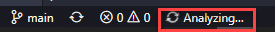
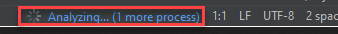
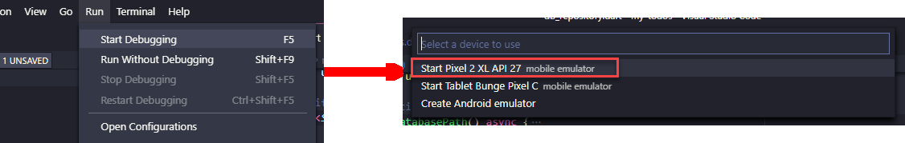
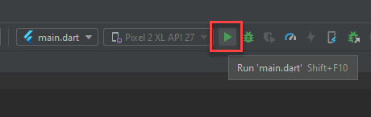

# my_tasks

App para cadastro de tarefas.

## Iniciar Projeto

Primeiro, abra a pasta principal do projeto em seu editor de código-fonte.

Aguarde a conclusão da análise de código feita pelo editor, como o exemplo abaixo:

- VSCode 
- Android Studio 

Agora, execute o comando **flutter pub get** para obter todas as dependências listadas no arquivo **pubspec.yaml**.

Após concluir os passos acima, você poderá executar o projeto. Siga os exemplos a baixo para os editores **VS Code** e **Android Studio**

- VSCode

- Android Studio

Para mais informações sobre Flutter, acesse a 
[documentação online](https://flutter.dev/docs).